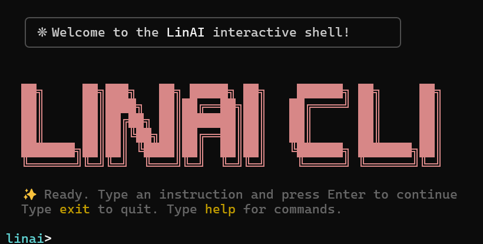

# LinAI CLI

> **Natural Language → Linux Terminal** — A high-performance, AI-native terminal assistant with a Claude Code-inspired aesthetic.

```
linai> create folder project, then list all files larger than 10MB
# → [Step 1/2] mkdir project
# → [Step 2/2] find . -maxdepth 1 -size +10M
```

<div align="center">
  
</div>

---

## 🎨 Modern Interface

LinAI features a polished, high-contrast terminal UI designed for clarity and safety:
- 🧱 **Claude Code Aesthetic** — Clean boxed layouts, terracotta ASCII art, and status footers for a premium feel.
- ⊘ **Safety First** — Every command is risk-scored (0-100) before execution. Blocked or confirmed based on severity.
- ⚡ **Interactive Flow** — Smooth spinners, step-by-step chaining, and color-coded results.
- ✦ **Direct AI Fallback** — When structured intent parsing fails, LinAI uses a secondary AI pipeline to generate best-guess commands.

---

## 🚀 Getting Started

### 1. Installation

```bash
# Clone the repository
git clone https://github.com/your-org/linai-cli.git
cd linai-cli

# Install dependencies
npm install

# Link globally (makes `linai` available everywhere)
npm link
```

### 2. Interactive Setup

Run the setup wizard to securely store your API keys and choose your preferred model:

```bash
linai setup
```

**Supported Providers:**
- 🔵 **Gemini** — High speed, generous free tier (Google).
- 🟢 **OpenAI** — Industry standard (GPT-4o).
- 🟣 **Claude** — Exceptional reasoning (Anthropic).
- 🟡 **Other** — Connect to **Ollama**, **Groq**, or **LocalAI** via custom Base URL.

---

## 🧩 How it Works: The Pipeline

LinAI doesn't just "guess" commands. It processes your request through a multi-stage intelligent pipeline:

1.  **Input Splitting**: Breaks complex strings (e.g., "do X then Y") into discrete logical steps.
2.  **Intent Parsing**: Matches steps against a library of hundreds of known Linux patterns.
3.  **Parameter Extraction**: Curates pathnames, flags, and values from your natural language.
4.  **Command Generation**: Reconstructs the exact shell syntax for your specific distro and environment.
5.  **Safety Validation**: Scans the generated command for destructive patterns before it ever touches your shell.

---

## 🛡️ Safety & Risk Scoring

LinAI protects your system by assigning a **Risk Score** to every generated command:

| Score | Level | Action |
|-------|-------|--------|
| **0 - 39** | **Safe** | Executes immediately. |
| **40 - 69** | **Risky** | Prompts for manual confirmation. |
| **70 - 100** | **Dangerous** | Blocked automatically (requires override). |

*Examples: `ls` (5), `mkdir` (10), `rm -rf` (95), `mkfs` (100).*

---

## 🐚 Advanced Usage

### Natural Language
- **Chain commands**: `linai "create src directory and initialize a git repo"`
- **Context awareness**: `linai "fix the permissions on this folder"` (automatically detects current path).
- **Simulation**: `linai "delete all .log files" --simulate` — See exactly what will happen.

### Interactive Shell
Launch the persistent REPL for complex workflows:
```bash
linai shell
```
- Multi-line command history (up/down arrows).
- Built-in commands: `help`, `clear`, `history`, `exit`.

### Learning Engine (`teach`)
Correct LinAI if it misses your intent. It remembers your preferences for next time:
```bash
linai teach "start production" "docker-compose up -d"
```

---

## 🗺 WSL Setup (Windows Users)

LinAI is optimized for **WSL (Ubuntu/Debian)**:

1. **Pathing**: Run LinAI inside `/home/user` for maximum speed. Accessing Windows drives (`/mnt/c/`) may be slower.
2. **Setup**: Run `linai setup` from within your WSL terminal.
3. **Shell Integration**: Add `alias l='linai'` to your `.bashrc` for lightning-fast access.

---

## 🔌 Plugin System

Extend LinAI without modifying the core. Plugins can hook into:
- `pre-execute` / `post-execute` events.
- New Intent patterns.
- Custom CLI flags.

**Example Plugin Structure:**
- `plugins/my-plugin/plugin.json` — Manifest & Hook definitions.
- `plugins/my-plugin/index.js` — Logic & Event listeners.

---

## 📂 Project Architecture

- **`src/cli/UIRenderer.js`** — The drawing engine.
- **`src/engine/CommandChainEngine.js`** — The "Brain" that manages the pipeline.
- **`src/ai/AIProviderManager.js`** — Handles keys, fallbacks, and multi-model routing.
- **`src/safety/SafetyFilter.js`** — The gatekeeper for dangerous operations.

---

## 🆘 Troubleshooting

- **Quota Exceeded**: If using Gemini's free tier, you may hit rate limits (15 RPM). Wait 1 minute or switch to a paid key.
- **Command Not Found**: Ensure you have run `npm link` and your global npm directory is in your `$PATH`.
- **Permission Denied**: Some commands (like `apt install`) will still require `sudo` prefixes or being run as root.

---

## License
MIT

